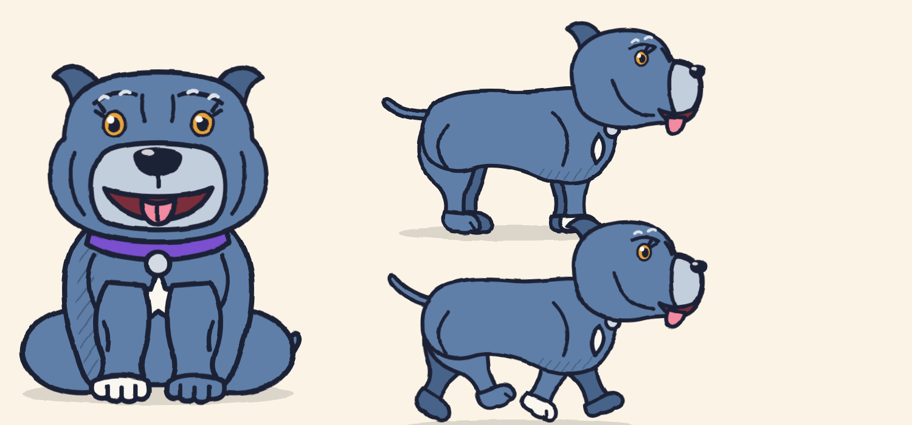

# Cleo, the Canine Confidence mascot

Cleo is based on Tristan's own blue staffy girl, pushed into a bolder cartoon style.

## Keep these consistent in every piece of content

| Feature | Detail |
|---|---|
| Coat | Bold cartoon blue `#5E7FA8`, shade `#46638A` |
| Head | Box-shaped staffy head, drawn about 14% narrower than the original promo dog (`headW: 0.86`), with cheek muscles, forehead wrinkles and folded rose ears |
| Muzzle | Silvery grey `#C3CEDC`, with silver flecks above the brows |
| Eyes | Amber `#E8A33A` with soft lashes |
| Markings | Small white star on the chest, one white front foot (the other paws are coat-coloured) |
| Collar | Purple `#7A4FD0` with a silver tag `#D3DAE3` |
| Style | Thick navy ink outline `#1F2036`, wobbly hand-drawn lines, no cheek blush |

## Using her

The character rig is `marketing/promo-video/dog.js`. Call `useLook('cleoHero')` before drawing, then use `sitDogSVG(id)` with `new SitDog(id).set(t, {...})` for the sitting, front-on pose, or `sideDogSVG(id)` with `new SideDog(id).set(t, {...})` for walking and running. The expression options are `brow` (normal, confused, sad, up), `mouth` (open, smile, frown), `happy`, `ears`, `tilt` and `wag`.

Note: the rig's default Cleo now has the slimmer head. `canine-confidence-cartoon.mp4` was rendered before that change, so it still shows the wider head until the video is re-rendered.
